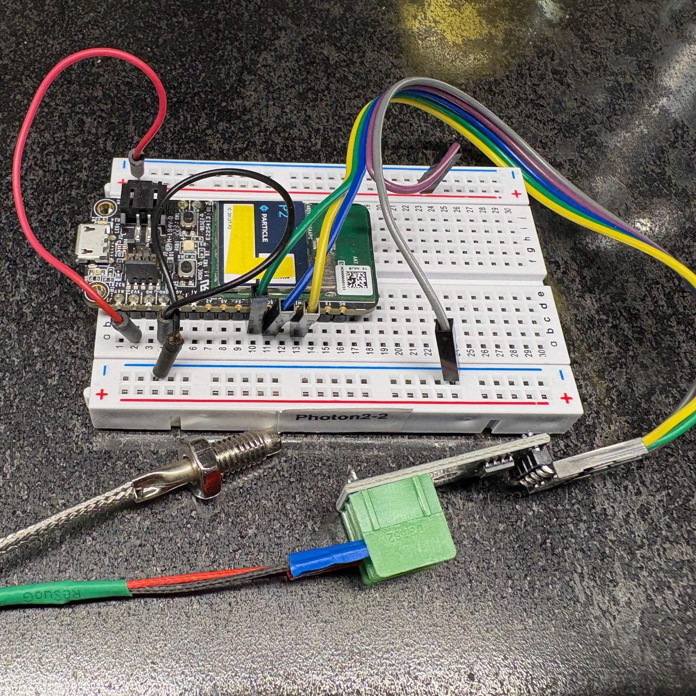

# MAX6675_RK

*MAX6675 SPI thermocouple library for Particle devices*

- Repository: https://github.com/rickkas7/MAX6675_RK
- License: MIT
- Full browseable API documentation: https://rickkas7.github.io/MAX6675_RK/index.html


## API

### Allocate an object

You will typically allocate one of these objects as a global variable.

```cpp
// Examples. Select only one!
MAX6675_RK sensor;
MAX6675_RK sensor(A0);
MAX6675_RK sensor(&SPI1, D5);
```

You can configure more than one sensor by creating multiple objects. Each sensor must have its own CS line.

```cpp
// Multiple sensors
MAX6675_RK sensor1(D2);
MAX6675_RK sensor2(D3);
```

### Initialize the object in setup()

```cpp
void setup() {
    sensor.setup();
}
```

### Read the value

Use the readValue() method to read the value:

```cpp
float value = sensor.readValue();
if (!std::isnan(value)) {
    Log.info("value=%f", value);
}
```

## Example

I purchased [this set](https://www.amazon.com/dp/B092ZCSM7J) of inexpensive MAX6675 with thermocouples from Amazon. There are many similar boards available on Amazon, eBay, and AliExpress.

| Pin  | Description | Connects To    | Picture        |
| :--- | :---------- | :------------- | :------------- |
| GND  | Ground      | GND            | Gray to GND    |
| VCC  | 3.0 to 5V   | 3V3            | Purple to 3V3  |
| SCK  | SCK         | SCK            | Blue to SCK    |
| CS   | Chip Select | Available GPIO | Green to S3    |
| SO   | Data Out    | MISO           | Yellow to MISO |

The CS pin can be connected to any available GPIO. There is a default CS pin named `SS` that varies depending on the device, but you don't have to specifically use that pin.

The color doesn't matter, and that is not the same Dupont wire that came with the thermocouple adapter as I wanted male-to-female instead of female-to-female. The colors are only listed to clarify the picture.



The connections on this adapter board:


The sample code in examples/1-Simple can be used to test the firmware side.

The output should look like this:

```
0000022622 [app] INFO: value=26.500000
0000024622 [app] INFO: value=26.750000
0000026622 [app] INFO: value=26.500000
0000028622 [app] INFO: value=26.500000
0000030622 [app] INFO: value=26.500000
0000032622 [app] INFO: value=26.250000
0000034622 [app] INFO: value=26.500000
0000036622 [app] INFO: value=26.500000
0000038622 [app] INFO: value=26.750000
```

If you disconnect the T+ or T- thermocouple connection, you should see something like:

```
0001088622 [app] INFO: value=26.500000
0001090622 [app] INFO: sensor not available
0001092622 [app] INFO: sensor not available
0001094622 [app] INFO: value=26.500000
```

If you disconnect the SPI interface, you will typically get a value of 0.

## MAX6675

From the datasheet:

**Cold-Junction-Compensated K-Thermocouple-to-Digital Converter (0°C to +1024°C)**

The MAX6675 performs cold-junction compensation and digitizes the signal from a type-K thermocouple. The data is output in a 12-bit resolution, SPI-compatible, read-only
format.

This converter resolves temperatures to 0.25°C, allows readings as high as +1024°C, and exhibits thermocouple accuracy of 8 LSBs for temperatures ranging from 0°C to +700°C.

The MAX6675 is available in a small, 8-pin SO package.

- Direct Digital Conversion of Type -K Thermocouple Output
- Cold-Junction Compensation
- Simple SPI-Compatible Serial Interface
- 12-Bit, 0.25°C Resolution
- Open Thermocouple Detection

Additionally:

- Unidirectional 3-wire SPI interface (SCK, CS, and SO only)
- 3.0 to 5.5V recommended supply voltage
- Serial clock frequency maximum: 4.3 MHz
- SPI Mode 3 (CPOL=1, CPHA=1) (data sampled on the second edge, idle high)


## Version History

### 0.0.1 (2025-12-10)

- Initial version
